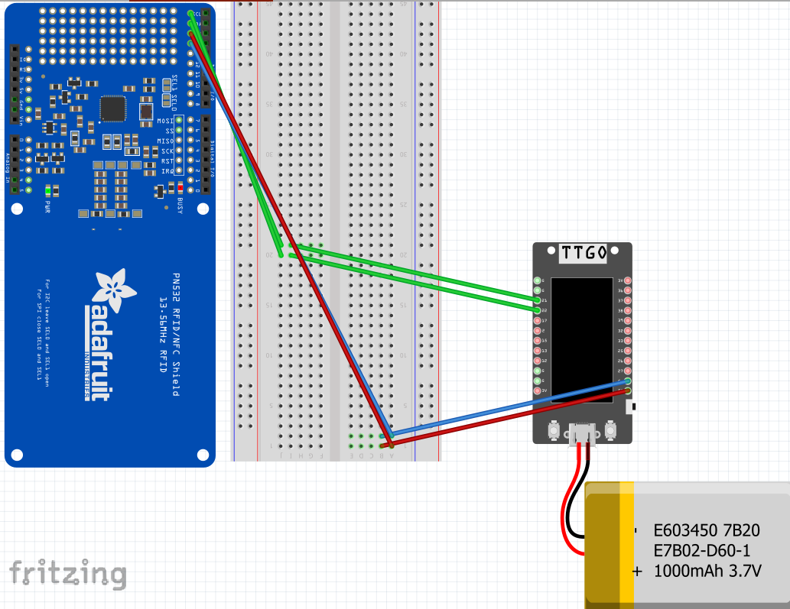
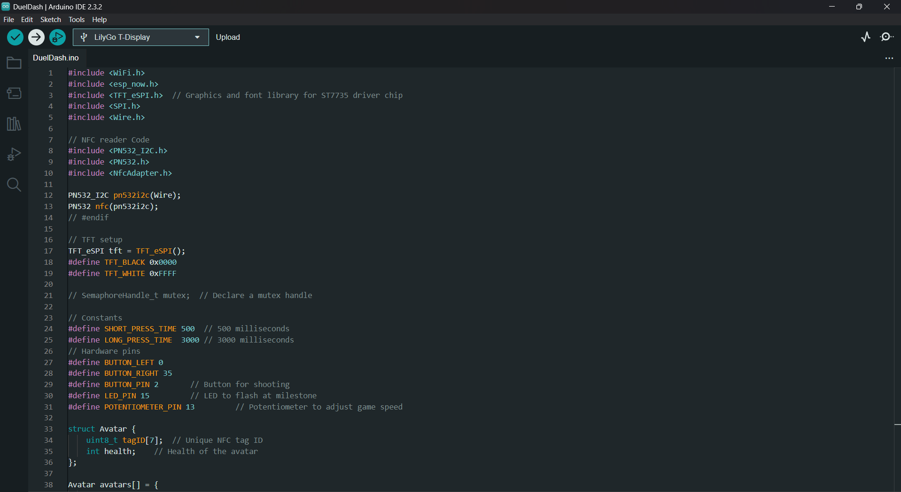
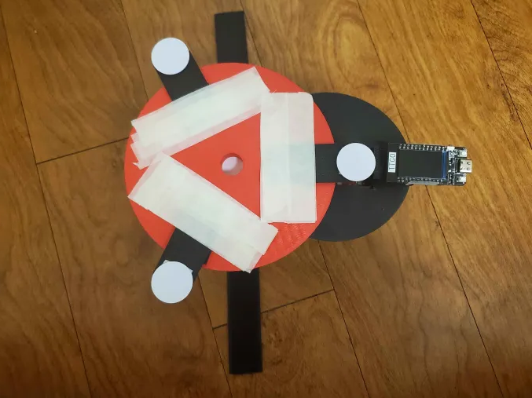
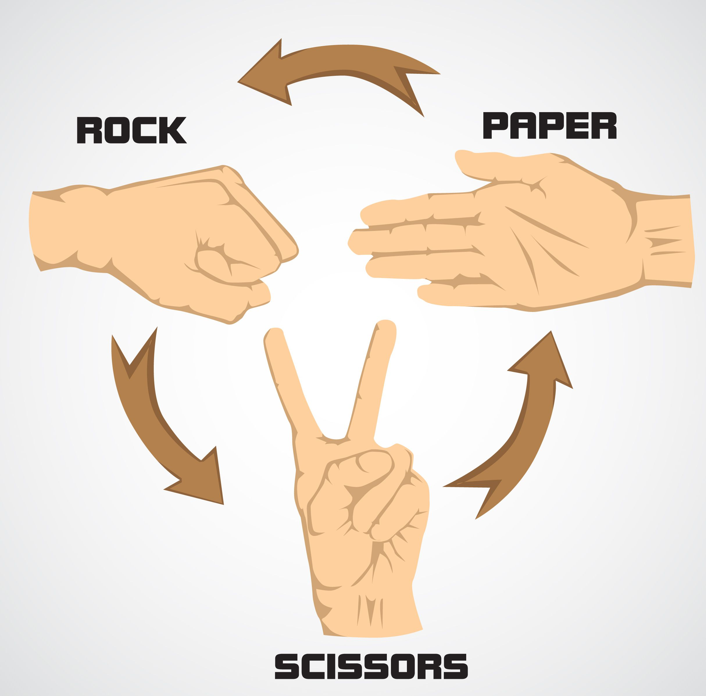
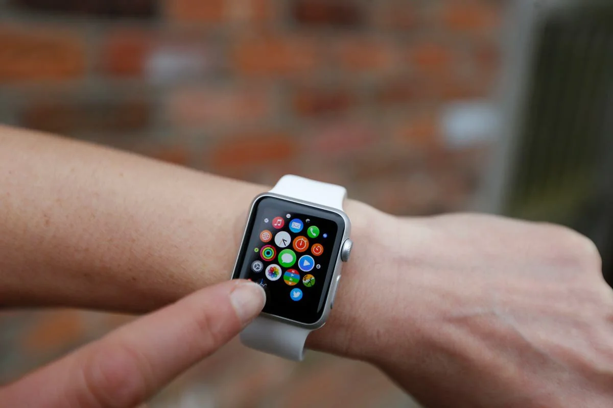

# Microcontroller Final Project Duel Dash
A 1v1 turned based wearable ESP32 device that acts as a controller with a game designed for a pair of ESP32s

*Here's a video of the game and controller in action: https://youtu.be/tnQcMq5Ct8E?feature=shared*

## Blog Post

You can take an in depth look at our process making this device and program in this blog [post](https://brassy-moonflower-6cd.notion.site/Dual-Dash-D2-15718fb9102d80f58f3fcc89c223d774?pvs=4)

## Table of Contents

- [Materials](#what-youll-need)
- [Installation Process](#installation)
- [Design Process](#design-process-and-goals)
- [Demos](#demos)
- [Contributors](#contributors)

## What You'll Need

 + [Arduino IDE](https://www.arduino.cc/en/software)
 + [Two 1000 mAh Lithium Rechargable Battery](https://www.amazon.com/1000mAh-battery-Rechargeable-Lithium-Connector/dp/B07BTWK13N/ref=sr_1_6?crid=101AM14WXNFD8&dib=eyJ2IjoiMSJ9.aYcE_selhm7YJrIDdOxwZUtfKCPameKjQAVnyCQnjW2_XaGXswwy79bUaMgn5w40YUOypY0CshhKOkwbec2MrBccoP42PQyXoTipmIQwVFRJOH4UQBPj1wdxoWgktCtVQwX1edUBTJ1_DYr5aZbTjXAPNelNrWZdUYMVlkkeovanGKu128uAZD0Wt1rYY13isNrNYp4lcrqZqyoqpZxCA0J_h6vvRUJvQVuXZf584rOVNijcqLixpdA9uBEkDtPJOIxZVK-Hv9UyRnTL3O0ZIIkj85FkGMTzIT7Aa1vqmwE.H1am0mHrqCf5Tp1lm_dzfIDjxTA5C-qtUZ5Z36XEUO8&dib_tag=se&keywords=1000%2Bmah%2Blithium%2Brechargeable%2Bbattery&qid=1733983449&sprefix=1000%2Bmah%2Blithium%2Brechargable%2Bbattery%2Caps%2C156&sr=8-6&th=1)
 + [Two ESP32 TTGO T-display Microcontroller](https://www.amazon.com/LILYGO-T-Display-Arduino-Development-CH9102F/dp/B099MPFJ9M?th=1)
 + [Two Breadboard](https://www.amazon.com/EL-CP-003-Breadboard-Solderless-Distribution-Connecting/dp/B01EV6LJ7G/ref=sr_1_13?crid=34X8PPI0DBVGL&dib=eyJ2IjoiMSJ9.BTT8MNHPlv4K77wqKb52By9wqhO8D20fweqTDbF_zIHk5F4fE59hggxnrwNQ0WXhfMPsTKopU72QV0E78jfiJeR5fH1-r-5-Q2f62ZiWHZy7h65OjWKk6AgCtgvFMVlXVZRIG69yOyUzEbciKw3e_0OFfyMyl9X4n0FXea0pxpK48cyxgtQxq43lyiDW5DwjB_Bq3DIBwFvGlJIo2jblZUu4Ld4rmyKi2xe2b-mCMhnRSnCmMXatnHMNUDiWfaURxkgUqREv3SQr-E_y-4mr8S33kuJ5zt8PwSmC5mEf--Y._KngmxBR7CKm46j1rh--lnUGY7WhmwhG7h8K_bJS7Vw&dib_tag=se&keywords=breadboard&qid=1730077539&s=industrial&sprefix=breadboard%2Cindustrial%2C112&sr=1-13)
 + [Jumper Wires](https://www.digikey.com/en/products/detail/bud-industries/BC-32626/5291560)
 + [Male to Female Jumper Wires](https://www.digikey.com/en/products/detail/adafruit-industries-llc/1954/6827087)
 + [3D Printer](https://www.amazon.com/HEPHI3D-Printers-Beginners-Assembled-Removable/dp/B0CMHJRM29/ref=sr_1_10?crid=2MK0PZ9VFMOSU&dib=eyJ2IjoiMSJ9.DpKNC2_35uTLj9pKGNT60blLVJ13BuHHYgOn2hbZcxlp15cPVac9dnOYXc2yjrsX196Kn7_Kb9NEiD1QlBCNqrsD8-CXHcAKH8VuNEcHzGtVCM0rgngYrydG3GsKtsvLSMS83G8ynVlFg_DfCHpUkPHEBQiyfTREEDyDJHbnV30WMia95MDjvbcMAXIWG5WNdvndyp_ybNoUQWyHfk2Ag1BJmeHdxYQKOew5AxtFsphUs-rnUmlt79imEpzL8j8OxBudoOtTds9JGuoE2qgX_1IL5WHcWAzfPGY9QQ3-T5E.g_wgq16-qBcScqvATYpUdqdRl_eUEwvmTmDpE1ClzT8&dib_tag=se&keywords=3d+printer&qid=1730077620&s=industrial&sprefix=3d+p%2Cindustrial%2C98&sr=1-10)
 + [Adhesive Tape of Your Choosing](https://www.amazon.com/Lichamp-General-Purpose-Painting-Stationery/dp/B07G97ZJ7Y/ref=sxin_15_pa_sp_search_thematic_sspa?content-id=amzn1.sym.76d54fcc-2362-404d-ab9b-b0653e2b2239%3Aamzn1.sym.76d54fcc-2362-404d-ab9b-b0653e2b2239&crid=2UEE9F17TEP2O&cv_ct_cx=tape&dib=eyJ2IjoiMSJ9.ltuWyEb4cIxg_G6TjJGGd5hToFDCJFCUctmCmhMpD_0zKcMRCj1QCYXLhxZCHC_t5gDelek12aG4L6x4-w50vQ.3ezT3uv5SMBbQd0xQCHEnYwg4asVE4yvN7ydjhQEcFY&dib_tag=se&keywords=tape&pd_rd_i=B07G97ZJ7Y&pd_rd_r=049ad745-920d-4bd7-91fa-da8bb7d1e324&pd_rd_w=Js0si&pd_rd_wg=dDkoB&pf_rd_p=76d54fcc-2362-404d-ab9b-b0653e2b2239&pf_rd_r=V80YXJ78XGQJ61TPJ08W&qid=1730077660&s=industrial&sbo=RZvfv%2F%2FHxDF%2BO5021pAnSA%3D%3D&sprefix=tape%2Cindustrial%2C98&sr=1-3-6024b2a3-78e4-4fed-8fed-e1613be3bcce-spons&sp_csd=d2lkZ2V0TmFtZT1zcF9zZWFyY2hfdGhlbWF0aWM&psc=1)
 + [Velcro Straps](https://www.amazon.com/YMCRLUX-Adjustable-Fastening-Reusable-Organizer/dp/B09XMVVRH8/ref=sr_1_4?crid=3MWZSD2P3PV94&dib=eyJ2IjoiMSJ9.w1ZL9xVojEV0BqeMUmybcXmymE8wiok5I0Z7MFM4HCn-IbPv8BV9RECbO-26XgVWFdloL7Mbysy5c6BAdDgMMEvLQj3QKwN_p36P3d2NlOnwtqhTyaBvLuv-FBootmduaQYbC6Jui0x3gSIXXdVwdiIZfjeCpVdksYkKM7I5PUZM3CDXGo8V3nuCeYryt20nEqrb2yDaLKr5mZaq_Ya69TUUSeF2dgBkJ4Ww3odaO7Q.ZoyPbaYDpznFnh_Usn5bKnT_Xu03a-KYTKzfUqh9bCE&dib_tag=se&keywords=velcro+straps&qid=1733983523&sprefix=velc%2Caps%2C122&sr=8-4)

## Installation
1. Download the `DualDash` folder and open the arduino sketch file inside named `DualDash.ino` on Arduino IDE
    * If Arduino IDE is not installed, check the [Arduino Support Page](https://support.arduino.cc/hc/en-us/articles/360019833020-Download-and-install-Arduino-IDE) to learn how to install it

2. Set up your breadboard and components so that it follows the Fritzing diagram circuit configuration below:

3. Once everything is set up, you can connect your ESP32 to your computer via USB-C and click on the `Upload` sketch button on the top left of the Arduino IDE after selecting your board and appropriate configurations. This will make the code compile and store onto the ESP32. Repeat this again for a second ESP32.

4. Lastly, feel free to 3D print the STL files in the `EnclosureSTLFiles` folder to then assemble an enclosure for the controller's circuit with tape to resemble a watch looking controller which can potentionally look like this:

## Design Process and Goals

This game reference is the inspiration behind the game of my wearable ESP32 device that depicts a 1v1 gesture based gameplay by the players by configuring their choice of three attacks against their opponent which inspired me to make a 1v1 turned based game of attrition using quick hand interactions with an NFC reader.

- Game Inspiration Reference:

  

This image represents the inspiration behind creating the wearable controller for interacting with the game that is displayed on the screen on the player's wrist.

- Controller Design Reference:

  

## Demos

This image showcases the final game rendering of the interactive game program.

- Final Result Static Image:

This image showcases the animated motion of the final game rendering of the interactive game program.

- Final Result Animated Image: 

## Contributors

- Daniel Manjarrez
- Mahdi Ali-Raihan
- Enrista Ilo
- Jie Ji
